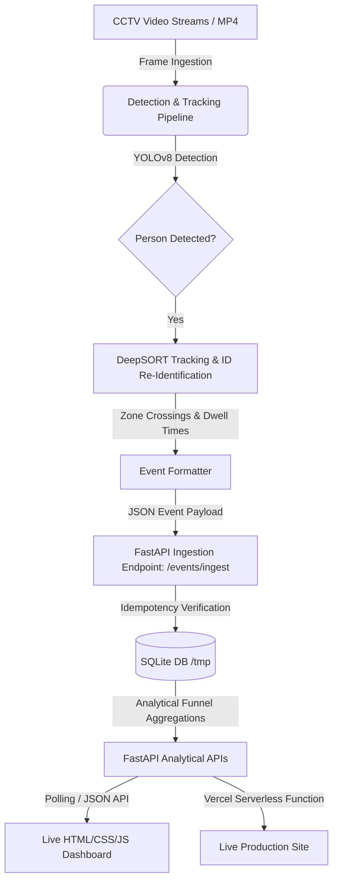

# 🏬 Store Intelligence System

[](https://fastapi.tiangolo.com/)
[](https://www.python.org/)
[](https://www.docker.com/)
[](https://vercel.com/)
[](https://opencv.org/)
[](https://ultralytics.com/)

An end-to-end, production-ready **Computer Vision and Real-Time Analytics Pipeline** built for physical retail environments. 

This system ingests raw CCTV video feeds, detects and tracks customer movement across customizable store zones (e.g., Entry, Skincare, Fragrance, Billing), detects operational anomalies (e.g., billing queue spikes, dead zones), and exposes a high-performance analytics API connected to a live, real-time metrics dashboard.

---

## 🗺️ System Architecture



---

## 🚀 Key Features

* **🎥 Real-Time Video Processing**: Ingests standard `.mp4` video files frame-by-frame, applying YOLOv8 for robust human detection.
* **👥 Intelligent Tracking**: Integrates `deep-sort-realtime` to keep persistent visitor sessions (Re-ID) across different camera boundary lines.
* **⚡ High-Throughput Analytics API**: A FastAPI backend that processes incoming batches of telemetry data asynchronously, verifying idempotency using SQLite database integrity constraints.
* **📊 Live Operational Dashboard**: A zero-dependency Vanilla HTML/CSS/JS frontend dashboard that visualizes store traffic metrics, checkout queue depths, conversion rates, and live anomaly alerts in real-time.
* **🐳 Containerized & Cloud Ready**: Fully containerized using Docker Compose, with full support for Serverless hosting on Vercel.

---

## 📂 Project Structure

```text
store-intelligence/
├── api/                       # Vercel Serverless Entrypoint
│   └── index.py               # Routes requests to the FastAPI application
├── app/                       # FastAPI Backend Application
│   ├── static/                # Vanilla Frontend Dashboard
│   │   ├── index.html         # Live dashboard layout
│   │   └── dashboard.js       # Real-time polling & DOM updates
│   ├── anomalies.py           # SQL queries for operational anomalies
│   ├── database.py            # SQLite database initialization & seeding
│   ├── funnel.py              # SQL queries for entry-to-purchase conversion funnels
│   ├── ingestion.py           # Idempotent batch insertion logic
│   ├── main.py                # FastAPI main application router & middleware
│   ├── metrics.py             # SQL queries for visitor traffic & dwell times
│   ├── models.py              # Pydantic schemas for event models
│   └── requirements.txt       # Local backend dependencies
├── pipeline/                  # Computer Vision & Tracking Pipeline
│   ├── detect.py              # YOLOv8 frame-by-frame object detection loop
│   ├── tracker.py             # DeepSORT stateful visitor tracking
│   ├── emit.py                # REST client for posting events to backend
│   ├── requirements.txt       # Video processing dependencies
│   └── run.sh                 # Pipeline startup script
├── tests/                     # Pytest testing suite
├── vercel.json                # Vercel deployment configuration
├── Dockerfile                 # Docker configuration for FastAPI app
├── docker-compose.yml         # Starts FastAPI backend & SQLite automatically
├── DESIGN.md                  # Core design choices & architecture definitions
└── CHOICES.md                 # Design trade-offs & AI-assisted choices
```

---

## ⚙️ Quick Start

### 1. Run the Backend & Dashboard (Docker)
The easiest way to boot up the FastAPI Server and the Live Dashboard is using Docker Compose:

```bash
cd store-intelligence
docker-compose up -d --build
```
Once initialized, the server runs on `http://localhost:8000`. You can inspect the health check endpoint:
```bash
curl http://localhost:8000/health
```

### 2. View the Live Dashboard
Open your web browser and go to:
👉 **[http://localhost:8000/dashboard/index.html](http://localhost:8000/dashboard/index.html)**

*Note: The database auto-seeds with realistic visitor traffic data on startup, so the dashboard is immediately functional.*

### 3. Run the Computer Vision Pipeline (Locally)
To run the CCTV tracking pipeline on a video feed, set up a local Python virtual environment:

```bash
# Create and activate virtual environment
python3 -m venv venv
source venv/bin/activate

# Install CV and Tracking dependencies
pip install -r pipeline/requirements.txt

# Run detection and tracking on a sample video
./pipeline/run.sh "/path/to/cctv_footage.mp4"
```

---

## ☁️ Deploy to Vercel (Live Preview)

The project includes built-in configuration for hosting both the frontend and backend live on **Vercel** via Python Serverless Functions.

### Deploy with Vercel CLI
1. Install the Vercel CLI globally:
   ```bash
   npm i -g vercel
   ```
2. Navigate to the `store-intelligence` directory and run:
   ```bash
   cd store-intelligence
   vercel
   ```
3. Follow the command prompts to link the project and deploy it. Vercel will generate a public URL.

*Note: In the Serverless environment, SQLite database is created in the `/tmp` folder and auto-seeds on startup. Data is ephemeral and resets once the container shuts down or recycles.*

---

## 📡 API Reference

### Event Ingestion
* **Endpoint**: `POST /events/ingest`
* **Description**: Ingests a list of telemetry events. Fully idempotent.
* **Payload**:
```json
[
  {
    "event_id": "evt-001",
    "store_id": "STORE_BLR_002",
    "camera_id": "CAM_ENTRY_01",
    "visitor_id": "VIS_9821",
    "event_type": "ENTRY",
    "timestamp": "2026-06-04T12:00:00Z",
    "zone_id": null,
    "dwell_ms": 0,
    "is_staff": false,
    "confidence": 0.98,
    "metadata": "{\"session_seq\": 1}"
  }
]
```

### Analytical Endpoints
| Method | Endpoint | Description |
|---|---|---|
| `GET` | `/stores/{id}/metrics` | Returns unique visitors, conversion rate, queue depth, and abandonment rate. |
| `GET` | `/stores/{id}/funnel` | Returns stage-by-stage conversion funnel stages (Entry → Zone Dwell → Purchase). |
| `GET` | `/stores/{id}/heatmap` | Returns density metric of visits mapped across store zones. |
| `GET` | `/stores/{id}/anomalies` | Returns active operational spikes (e.g. queue congestion, dead zones). |
| `GET` | `/health` | Server status and database health. |

---

## 🧪 Testing

The API uses `pytest` for validation. To run the automated unit and integration tests:

```bash
# Install app dependencies
pip install -r app/requirements.txt

# Run test suite
pytest
```
